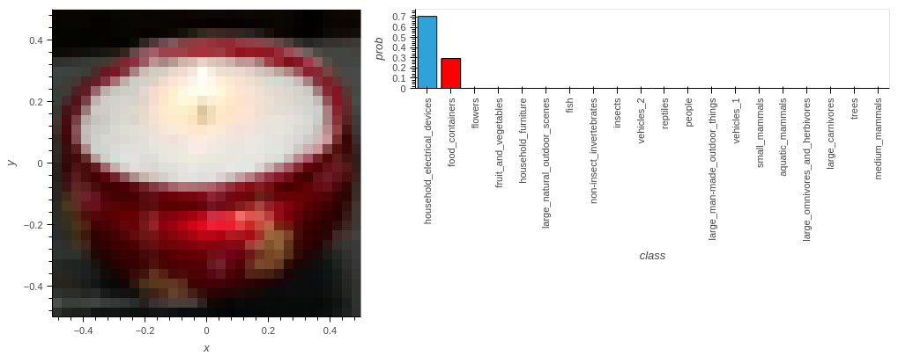
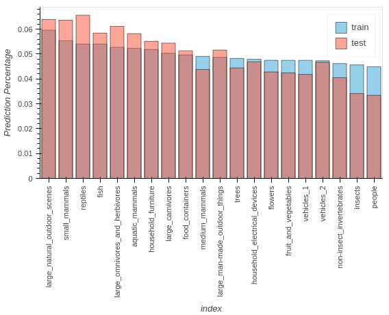
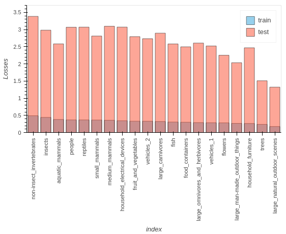
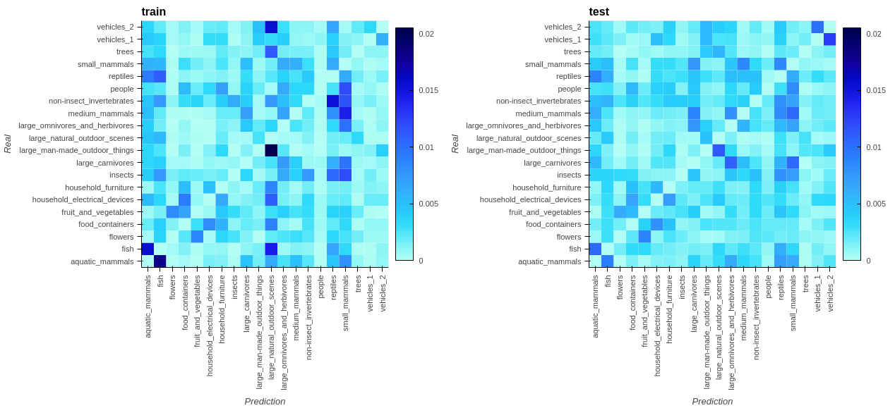
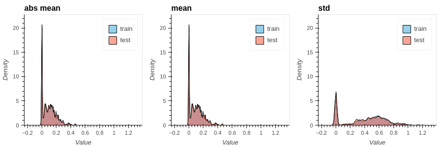
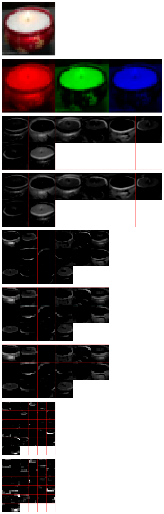

# The first model

## Model specification

**Data**
- [cifar100](https://knowyourdata-tfds.withgoogle.com/#tab=STATS&dataset=cifar100) with corase labels (20 classes)
- No image augmentation 

**Model**
```python
model = keras.Sequential([
    keras.layers.Conv2D(8, (3,3), input_shape=(32,32,3), activation='relu',), 
    keras.layers.Dropout(0.2), 

    keras.layers.Conv2D(16, (3,3), activation='relu'), 
    keras.layers.MaxPool2D((2,2)),
    keras.layers.Dropout(0.2), 

    keras.layers.Conv2D(32, (3,3), activation='relu'), 
    keras.layers.MaxPool2D((2,2)),
    
    keras.layers.Flatten(),

    keras.layers.Dense(500, activation='relu'), 
    keras.layers.Dropout(0.2), 

    keras.layers.Dense(20, activation='softmax'), 
])
```

```
Model: "sequential"
_________________________________________________________________
 Layer (type)                Output Shape              Param #   
=================================================================
 conv2d (Conv2D)             (None, 30, 30, 8)         224       
                                                                 
 dropout (Dropout)           (None, 30, 30, 8)         0         
                                                                 
 conv2d_1 (Conv2D)           (None, 28, 28, 16)        1168      
                                                                 
 max_pooling2d (MaxPooling2  (None, 14, 14, 16)        0         
 D)                                                              
                                                                 
 dropout_1 (Dropout)         (None, 14, 14, 16)        0         
                                                                 
 conv2d_2 (Conv2D)           (None, 12, 12, 32)        4640      
                                                                 
 max_pooling2d_1 (MaxPoolin  (None, 6, 6, 32)          0         
 g2D)                                                            
                                                                 
 flatten (Flatten)           (None, 1152)              0         
                                                                 
 dense (Dense)               (None, 500)               576500    
                                                                 
 dropout_2 (Dropout)         (None, 500)               0         
                                                                 
 dense_1 (Dense)             (None, 20)                10020     
                                                                 
=================================================================
Total params: 592552 (2.26 MB)
Trainable params: 592552 (2.26 MB)
Non-trainable params: 0 (0.00 Byte)
_________________________________________________________________
```

**Training**  
Batch size = 16
```python
model.compile(
    optimizer='adam', 
    loss=keras.losses.SparseCategoricalCrossentropy(), 
    metrics=['accuracy']
)
```


```
Epoch 50/50
3125/3125 [==============================] - 11s 4ms/step - loss: 0.6368 - accuracy: 0.7908 - val_loss: 2.6305 - val_accuracy: 0.4431

```


## Notes
- Overfitting 
- There are dropout layers but they aren't obvious in the filters
- orientation and colour selectivties were developed even though it's overfitting
    - idea: can make tools to access feature selectivities
    - Can learn more about input optimisation 
- 8 filters aren't enough for the first layer for both orientations and colours
- I want to know in what ways overfitting happens. Is it possible to be visualised? 
    - perhaps do PCA weights or outputs of the dense layer
- of those 500 units in the dense layer, 140 of those aren't active in all the testing data
    - how about the training data? 


# Key visualisations
**An example of the prediction drawn from the test split:**


**The percentage of prediction for each category**

All the categories have equal occurance in the data. An uneven prediction occurance is indicative of poor performance. Both the testing and training predictions have biases to similar categories but the bias is stronger in the testing predictions. 

**The loss for each category (true category)**

The training loss is much smaller than the testing loss due to overfitting. The losses of the testing and training results follow similar trend. The model performs the poorest for trees and large_natural_outdoor_scences. 


**The confusion matrix with the diagonal eye masked:**

Fish and aquatic mammals are confused
The model tends to categorised images as small mammals and reptiles for some reasons. 

**The response summary of the units in the second last dense layer**

- A lot of units (122 of 500) are completely inactive. The very 0 mean and 0 std. 
    - I tried anther model with only 256 units at this layer. Still there were a lot of inactive units. I guess that's because I'm using relu? 
- Very surprisingly (to me), the units have very similar responses statistics to the training and testing data. 
    - Should look into the response distribution of each unit
- Medians are always 0 (not shown here). The responses are very sparse. 


**An example of filter images in the model**

- There're colour selectivity and orientation selectivity
- 8 filters aren't enough for the first layer for both orientations and colours
- I don't see the effect of the dropout layers
